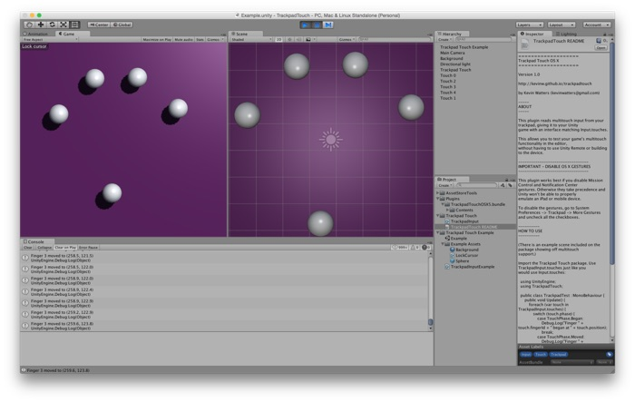

<style>
  body {
    background: url(tt_pattern-small.png);
  }
</style>


[Asset Store Link](https://www.assetstore.unity3d.com/)

<a href="TrackpadTouchEditorScreenshot.png"></a>

## About

This plugin reads multitouch input from your trackpad, giving it to your Unity
game with an interface matching [Input.touches](http://docs.unity3d.com/ScriptReference/Input-touches.html).

This allows you to test your game's multitouch functionality in the editor,
without having to use Unity Remote or building to the device.

## Important: Disable OS X Gestures

This plugin works best if you disable Mission Control and Notification Center
gestures. Otherwise they take precedence and Unity won't be able to properly
emulate an iPad or mobile device.

To disable the gestures, go to System Preferences -> Trackpad -> More Gestures
and uncheck all the checkboxes.

## How to Use

(There is an example scene included on the package showing off multitouch
support.)

Import the Trackpad Touch package.

Use TrackpadInput.touches just like you would use Input.touches:

```csharp
using UnityEngine;
using TrackpadTouch;

public class TrackpadTest : MonoBehaviour {
  public void Update() {
    foreach (var touch in TrackpadInput.touches) {
      switch (touch.phase) {
        case TouchPhase.Began:
          Debug.Log("Finger " + touch.fingerId + " began at " + touch.position);
          break;
        case TouchPhase.Moved:
          Debug.Log("Finger " + touch.fingerId + " moved to " + touch.position);
          break;
        case TouchPhase.Ended:
        case TouchPhase.Canceled:
          Debug.Log("Finger " + touch.fingerId + " ended");
          break;
      }
    }
  }
}
```

See the [Touch](http://docs.unity3d.com/ScriptReference/Touch.html) and [TouchPhase](http://docs.unity3d.com/ScriptReference/TouchPhase.html) classes in the Unity docs for more info on how
to use the Input.touches interface.


